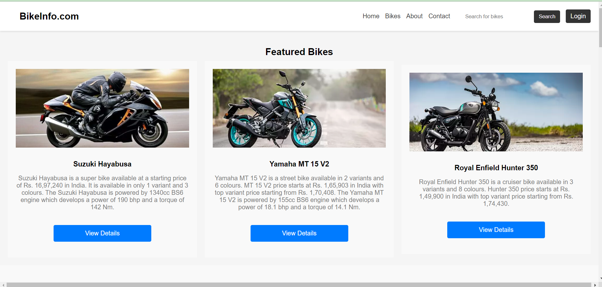
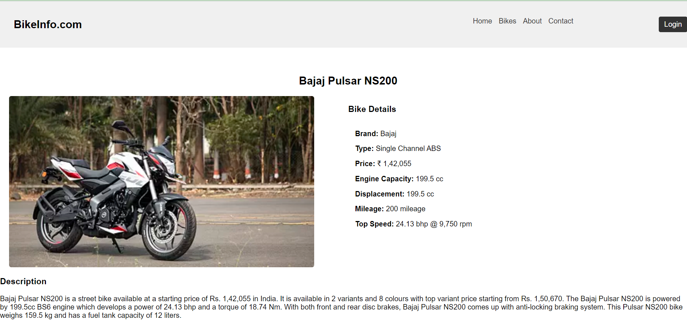

# 💬 Bike Info Site

A simple full-stack bike information and review web app built with:

🚀 **Frontend**: HTML + Jinja2 (Flask templates)  
🔧 **Backend**: Python Flask  
🗃️ **Database**: Firebase Realtime Database (via Pyrebase)

---

## 📸 Screenshots

### 🏠 Home Page (Brand Listing)


### 🏍️ Bike Brands


### 🚲 Bike Details with Reviews


---

## 📁 Project Structure

```

/bike-info-site
├── /screenshots         # App screenshots
├── /static              # Static assets (CSS, JS, etc.)
├── /templates           # HTML templates (Jinja2)
├── README.md            # Project documentation
├── database.json        # Sample Firebase DB structure (optional/backup)
├── main.py              # Flask application entry point
├── requirements.txt     # Python dependencies

````

---

## 🛠️ Prerequisites

Ensure you have the following installed:

- ✅ Python 3.7+
- ✅ pip (Python package manager)
- ✅ Firebase account with a Realtime Database
- ✅ Git

---

## ⚙️ Firebase Setup

1. Go to [Firebase Console](https://console.firebase.google.com/)  
2. Create a project and enable **Realtime Database**  
3. Go to **Project Settings > General > Firebase SDK snippet**  
4. In `main.py`, update the `config` dictionary:

```python
config = {
    "apiKey": "YOUR_API_KEY",
    "authDomain": "YOUR_AUTH_DOMAIN",
    "projectId": "YOUR_PROJECT_ID",
    "databaseURL": "YOUR_DATABASE_URL",
    "storageBucket": "YOUR_STORAGE_BUCKET",
    "messagingSenderId": "YOUR_MESSAGING_SENDER_ID",
    "appId": "YOUR_APP_ID",
    "measurementId": "YOUR_MEASUREMENT_ID"
}
````

---

## 📦 Installation & Running the App

### 🚀 Backend Setup

1. Clone the repository:

   ```bash
   git clone https://github.com/essakirajas/bike-info-site.git
   cd bike-info-site
   ```

2. Create a virtual environment (recommended):

   ```bash
   python -m venv venv
   source venv/bin/activate     # On Windows: venv\Scripts\activate
   ```

3. Install dependencies:

   ```bash
   pip install -r requirements.txt
   ```

4. Start the Flask app:

   ```bash
   python main.py
   ```

App will run at:
📍 `http://localhost:5000/`

---

## 🧪 Testing the App

Visit:

* 🧭 `http://localhost:5000/` – Browse brands
* 🔍 `http://localhost:5000/brand/<brand>` – View bikes by brand
* ⭐ `http://localhost:5000/bike/<bike_id>` – Bike details and review submission

---

## ✅ Example `requirements.txt`

```
Flask==2.3.3
pyrebase4==4.5.0
```

---

## 🏗️ Production Considerations

To run the app in production:

* Use `gunicorn` or `waitress` instead of Flask’s dev server
* Store Firebase config securely using environment variables
* Deploy to platforms like Heroku, Render, or DigitalOcean

---

## 📌 Notes

* Ensure Firebase Database rules allow necessary read/write access
* Reviews are stored under both `bikes/<bike_id>/reviews` and `reviews/<bike_id>` — you may optimize the structure
* You can style the frontend using Bootstrap or Tailwind CSS
* For real-time reviews, consider Firebase listeners or WebSocket integration in the future

---

## 📄 License

This project is licensed under the **MIT License**

```

---

Let me know if you’d like me to auto-generate or clean up your HTML templates (`index.html`, etc.) or provide Firebase DB rules to go along with this.
```
